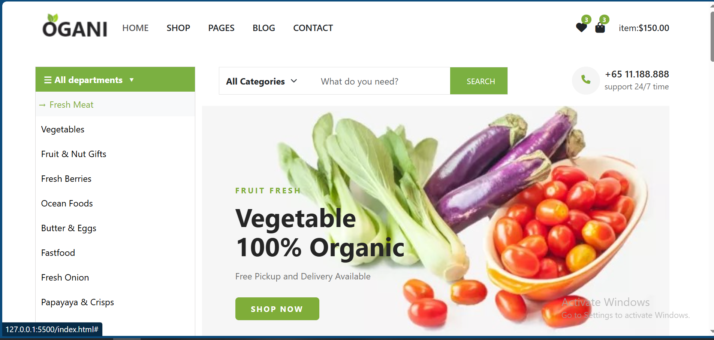
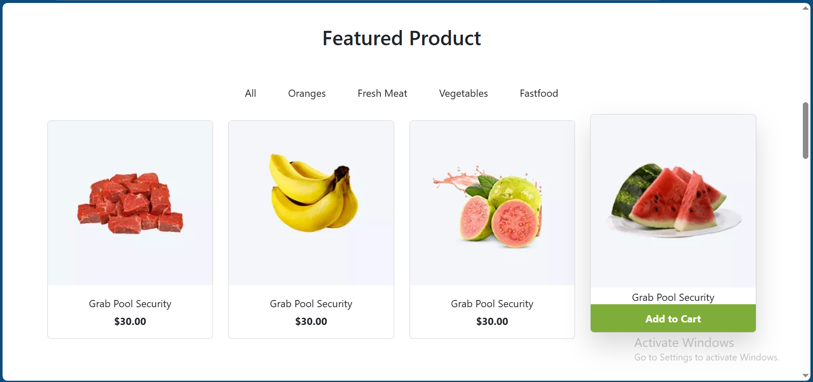

# Ogani

An organic products e-commerce website with modern design and responsive layout.

## 🚀 Live Demo

[View Website](https://sarah2-web.github.io/Ogani/)

## 🛠️ Technologies Used

- HTML5
- CSS3
- Bootstrap

## ✨ Features

- Fully responsive design
- Modern and clean user interface
- Product showcase section
- Interactive navigation
- Contact form

## 📸 Screenshots





## 🚀 Getting Started

1. Clone the repository:
   ```bash
   git clone https://github.com/sarah2-web/Ogani.git
